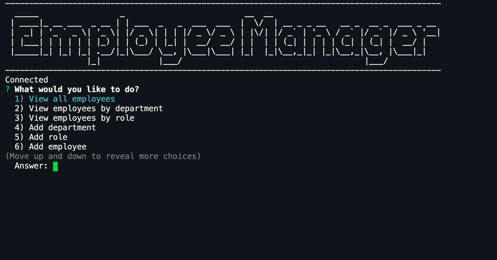
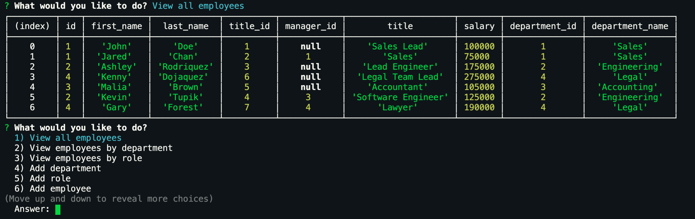
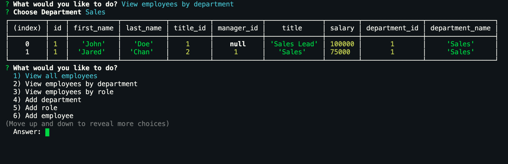

# employee-tracker

## Description

The Employee Tracker is a Content Management System that uses Node, Inquirer, and MySQL to manage a company's employees. 

## Table of Contents
- [Demo](#Demo)
- [Screenshot](#Screenshot)
- [Technology Concepts](#Technology-Concepts)
- [License](#License)

## Demo

## Screenshot

## Technology Concepts

* Node.js
* Inquirer.js
* MySQL

## License
[MIT](https://choosealicense.com/licenses/mit/#) License